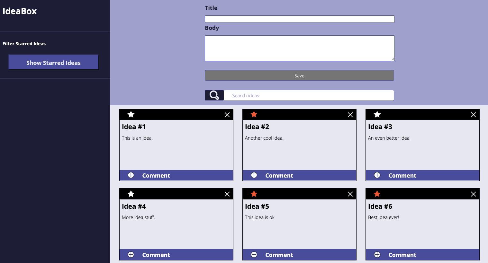

# Idea Box

## Contributors:
- [**Brian Forbes**](https://github.com/Codeherder19)
- [**Christina Cook**](https://github.com/christina-cook)
- [**Luke Mason**](https://github.com/LukeMason33
)
- [**Johnny Cassidy**](https://github.com/pJanks)

## Technologies Used:
- *JavaScript*
- *HTML*
- *CSS3*
- *Flex-box*
- *Github*
- *Google Chrome - Developer Console*

## Instructions for running/viewing the project:
Welcome to Idea Box! To get started, just enter a title for your idea in the title input field, enter the idea itself in the body input field, press the save button and VOILA! You will see your idea card appear in the blank section below! Do you have many ideas, some more favored than others? Click the star icon to "favorite" an idea. Got a lot of ideas, some favorite and some not so favorite and you need to filter through them? Click on the "Show Starred Ideas" button to the left and you will see only those with a red star which indicates it is a favored idea. If you want to view all of your ideas again, simply click the "Show All Ideas" button (formerly "Show Starred Ideas") and you will see every idea, favorite or not. You can also search all of your ideas by key words or phrases! Simply type the key word or phrase into the "search ideas" input field and your ideas will be filtered to only show those that contain the key word or phrase in either the title or the body. Once you are done with an idea or no longer need to store it in Idea Box, click the "X" in the top right hand corner of the idea card to delete it. Local storage is updated every time you create, favorite, or delete a card, so your ideas are safe should you decide to end your session or accidentally reload the page.

### Deploy Links
[Find the repo here](https://github.com/LukeMason33/ideabox-boilerplate.git)
[Find link to project page here](https://lukemason33.github.io/ideabox-boilerplate/
)

### Future Additions:
1. The ability to edit/update an existing idea's title or body instead of having to delete and create a new card.
2. Add responsiveness so that the idea cards section would expand and retain it's styling/CSS properties as idea cards overflow from the idea cards section. The section currently maxes out at 6 cards before pushing below the bottom of the page.
3. Setting the cards up to have a stackable view similar to a game of solitaire, so you can see the titles only, and bring any selected idea to the forefront by clicking on the title itself. This would allow more idea cards to be stored in the idea cards section and add organization. It would be nice to be able to group similar ideas together in their own sections. For example, if you were brainstorming ideas for movies/screenplays, but also had a lot of ideas for songs/lyrics, you could stack your ideas in the respective category/column/section.
4. Allowing comments to be added/edited for each idea.

### Wins:
- We gained a better understanding of CSS properties and how to use flex-box to orient our HTML elements in order to match a comp.
- We successfully manipulated the data model so our local storage would update every time we favored/deleted/added an idea card. These changes would also be reflected in our ideas array.
- We worked well together as a team, staying positive even when the going got tough.
- If we were stumped after trying to tackle a problem for a long period of time, we sought outside help from mentors, rocks, or fellow cohort members.
- We made sure we stuck to the agreement outlined in our DTR, making ourselves available to work together often, as well as making time for work life balance to maintain our health and sanity.

### Challenges:
- Overcoming some of the steep learning curve associated with flex-box.
- Applying local storage to our project which was an entirely new concept we learned in class the same day we needed to implement it.
- Writing functionality that would ensure cards or favorite icons would persist on page reload.
